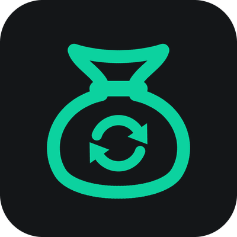

# EllesmereUI Bags: Alts



A companion addon for **[EllesmereUI](https://github.com/EllesmereGaming/EllesmereUI) Bags** in
World of Warcraft: Midnight (12.x). It remembers what all your characters carry: bags,
equipped gear, character bank, warband bank, mailbox, own auctions, currencies and,
if you want, your guild bank. It shows that stock in item tooltips and in a browser
window across all characters, similar to Baganator, in EllesmereUI's look.

> **About AI assistance.** This addon was built with an AI coding assistant (Claude,
> by Anthropic), used strictly as an implementation tool. The idea, the scope, the
> design decisions and the direction of every change came from the human maintainer,
> who guided the work closely throughout development and tested it manually in the
> game along the way. The AI was not used as a source of ideas. Every feature has been
> validated in the game by a human.
>
> The ten translations besides English were generated by the AI and have not been
> reviewed by native speakers. **Corrections are very welcome**, see
> [Languages](#languages).

Version 0.8.5, by Blackskyliner.

## What it does

- **Remembers every character** on which you use it. Bags (incl. reagent bag),
  equipped gear, gold, level and guild are kept up to date while you play. Bank,
  warband bank, mailbox and (opt-in) guild bank are recorded when you visit them;
  own auctions whenever the client reports them at the auction house.
- **Tooltip counts** (opt-in): every item tooltip lists which character has how
  many and where (bags, bank, equipped, mail, auctions), plus the warband bank,
  guild banks and a total.
- **Browser** (`/alts`): a window with all characters grouped by realm, the warband
  bank and your guild banks, with tabs for bags, bank, equipped, mail, auctions and
  currencies. An **Everything** tab merges all locations of a character, and the
  **All characters** entry and every realm header merge everything you own.
- **Search** across all characters and all stored currencies.
- **Currencies** grouped into character-bound, transferable and warband-wide, with
  a tooltip that shows who holds how much.
- **Auction tracking**: posted auctions appear immediately, cancelled and expired
  ones move to "Mail -> In transit", sold ones wait under "Mail -> Sold" with the
  amount until you open the mailbox. The auctions footer shows the value of all
  active auctions.
- **Bound state and equipment sets**: stored items remember whether they are
  soulbound or warbound, and which equipment sets they belong to.
- **A button in the EllesmereUI bag header** (opt-in) that opens the browser.
- **English plus ten translations**, the same set as EllesmereUI.

It only displays. The browser never uses, moves or picks up items.

## Design principles

The addon follows the five acceptance criteria EllesmereUI sets for its own code
(`.github/CONTRIBUTING.md` in the EllesmereUI repository). In short:

- **Nothing happens until you use it.** At login the addon scans nothing, checks no
  data and registers no collector event. It only waits for its first use in a
  session (opening the EUI bags, a bank, mailbox, auction house or guild bank, the
  browser, `/alts selftest`, a call of the public API, or the first item tooltip
  when tooltip counts are on). Then it records the current character once and
  stays event-driven from there. Before that, only its settings page, slash
  commands, the activation triggers and the first-run hint exist.
- **Nothing visible without consent.** Tooltip counts, the header button, EUI
  categories, the guild bank and the active auction query are off by default. The
  one exception is the consent question itself (see First run).
- **Cheap when on.** Event-driven only, no polling, no timers; bursts of events
  (bag updates, an equipment set swap, browser refreshes) are coalesced into one
  pass on the next frame. Tooltip counts come from caches, unit and world tooltips
  cost nothing.
- **No taint.** No secure templates, no fields written onto EllesmereUI or Blizzard
  frames, no hooks on Blizzard's bag windows; the browser shows items and caged
  pets on tooltips of its own.
- **Midnight only.**

Every access to EllesmereUI goes through a small connector layer
(`Libs/EUIBagsExt`). EllesmereUI itself is never modified. A proposal for native
extension points in EllesmereUI Bags is in [`upstream/`](upstream/).

## Requirements

- World of Warcraft: Midnight 12.1 or later. The TOC lists the same interface
  versions as EllesmereUI (12.0 to 12.1), but current EllesmereUI switches itself
  off on clients before 12.1, and this addon stays inert with it.
- **EllesmereUI with the Bags module** (a dependency; EllesmereUI's core plus the
  Bags module is enough, the other modules are not needed).
- Optional: EllesmereUI's Blizzard skin module (EllesmereUIBlizzardSkin). With it
  the browser wears EllesmereUI's window look, without it a plain look of its own.

## Installation

1. Copy the folder `EllesmereUIBags_Alts` (or the contents of
   `dist/EllesmereUIBags_Alts-<version>.zip`) into
   `World of Warcraft/_retail_/Interface/AddOns/`.
2. Check under "AddOns" on the character selection screen that
   "EllesmereUI Bags: Alts" is enabled. Without EllesmereUI Bags, WoW reports a
   missing dependency and does not load it.
3. Log in each character once and open its bags; visit a banker once for bank
   data and a mailbox once for mail.

## First run

- Until you first open your bags, every login prints one chat line pointing to
  `/alts`.
- The **first time you open your bags**, a popup asks whether to turn on tooltip
  counts and the bag header button. It waits until then because EllesmereUI shows
  its own popups at login.
- Change your mind any time: Options -> AddOns -> "EllesmereUI Bags: Alts", or
  `/alts options`. Besides the tooltip and EllesmereUI options, the section "Data
  collection" switches every source on its own: bags, equipped gear, bank and
  warband bank, mail, currencies and own auctions are on, the guild bank and the
  auction query on opening are off.

## Usage

| Command | Effect |
|---|---|
| `/alts` | Open or close the browser (`/euialts` works too) |
| `/alts search <text>` | Search across all characters (short: `/alts s`) |
| `/alts options` | Open the options (also `/alts config`) |
| `/alts tooltip` | Tooltip counts on/off |
| `/alts status` | Version, stored characters, whether and by what the addon was activated, active features, registered events |
| `/alts debug` | Diagnostic chat output on/off (e.g. auction events with IDs, the guild bank walk). Useful for bug reports. |
| `/alts selftest` | Compares this character's stored data with the game (see the test plan) |
| `/alts delete Name-Realm` | Delete another character's data (asks first) |

**Browser.** On the left the characters grouped by realm, then the warband bank
and the guild banks. At the top the tabs Everything, Bags, Bank, Equipped, Mail,
Auctions and Currency. Hover shows the item tooltip, shift-click links an item
in chat, ctrl-click opens the dressing room. "Delete data" at the bottom removes
another character or a guild bank (asks first); the current character and the
warband bank cannot be deleted.

**Overviews.** "All characters" at the top of the sidebar and every realm header
show all stored items merged: equal items share one slot with the total amount,
gear with different links stays apart. Items are grouped by item class, or by
EllesmereUI's bag categories when that option is on. The Everything tab covers
bags, banks, equipped gear, mail, auctions and guild banks; the other tabs filter
by location. Every character has an Everything tab as well. In these views the
tooltip always shows who holds how many, even with tooltip counts off. A realm
overview contains only that realm's characters and guild banks; the warband bank
is account-wide and belongs to "All characters". The footer shows the total gold
and the number of characters.

**Currencies.** Grouped into character-bound, transferable (within the warband)
and warband-wide (shared, shown only if any exist). The kind of every currency is
remembered account-wide, so offline characters sort correctly too. Hovering a
currency shows Blizzard's currency tooltip plus every character's amount and, when
more than one character holds it, the total; warband-wide currencies show their one
shared amount. Overviews add currencies up; warband-wide ones count once.

**Bound state and sets.** A stored item that is bound shows "Soulbound" or
"Warbound" in the browser tooltip instead of the generic "Binds when equipped";
items without such a line can still move. If an item belongs to equipment sets
(bags or worn), the tooltip names them.

**Search.** Words (parts of the name), `id:12345` (item ID; a bare number as the
first term is taken as an item ID too), `q:epic` or `q:4` (quality), `t:armor`
(type/subtype). All terms must match. The search covers characters, the warband
bank and guild banks and shows at most 300 items. Words and a number also search the
names of stored currencies; those hits come first, with the total and the
per-character amounts. `id:`, `q:` and `t:` filter items only.

**Tooltip counts.** One line per character with the split by location, plus the
warband bank, guild banks and the total, at most ten characters. They appear on
the game's item tooltip (bags, bank, auction house and so on), on chat link
tooltips and in the browser, never on comparison tooltips, units or world
objects. Options: only while Shift, Ctrl or Alt is held; realm scope
(connected realms, this realm, all realms); total; hide the current character;
include the warband bank; include guild banks.

## When data is recorded

Nothing is recorded before the first use in a session (see Design principles).
If that first use is opening a bank, mailbox, auction house or guild bank, that
visit is already recorded. After that:

| Source | When | Note |
|---|---|---|
| Bags incl. reagent bag | continuously | after every change, batched per update burst |
| Equipped gear | continuously | once per burst (an equipment set swap is one pass) |
| Gold, level, guild | continuously | |
| Character bank + warband bank | **only at the banker** | "Bank scanned" timestamp in the browser |
| Mail | **only at the mailbox** | the mails the client has loaded (the inbox shows up to 50 at a time); mail to your own characters appears at once as "In transit" at the recipient |
| Own auctions | **only at the auction house** | Passive by default: what the client reports, e.g. when the Auctions tab opens. Opt-in: query on opening. New auctions appear immediately, also with the confirmation dialog and multi-posts. Cancelled ones move to "Mail -> In transit" at once, expired ones as soon as the game reports it (also away from the AH), otherwise at the first use in a later session. Sold ones show with the amount under "Mail -> Sold" until you open the mailbox; they are detected live (sale notification, also outside the AH) and when the list is compared, for commodities including partial sales. |
| Currencies | continuously | the first list only contains expanded categories, every change after that is recorded |
| Guild bank (opt-in) | **only at the guild bank** | reads every tab you may view |

Loading screens (instances, portals) trigger no rescans.

### Storage

The data lives account-wide in `WTF/Account/<ACCOUNT>/SavedVariables/EllesmereUIBags_Alts.lua`
(`EllesmereUIBagsAltsDB`), deliberately apart from EllesmereUI's own saved
variables. Every bag, bank tab and guild bank tab is stored as **one** string
(`"slot:itemID,count;..."`); item links keep only their `item:` core, name and
colour come from the item cache. With 20 characters holding 150 items in their bags
and 300 in their bank, plus 300 in the warband bank, that is about 200 KB, and
loading it takes under a millisecond (measured in Lua 5.1). Data from versions
before 0.8.0 is converted once on the first use; older versions of the addon
cannot read the new format.

## Limitations

- Bank, mail and guild bank are only as current as your last visit; the browser
  footer shows the timestamps.
- Only mail to characters on which the addon has been used at least once (for
  example, bags opened) is tracked.
- Only the mails the client has loaded are read (up to 50 at a time); currency
  attachments and gold sent by mail are not recorded. "Gold in mail" is the gold
  of sold auctions.
- Bag changes in combat or instances, while the game hides the data, are stored
  after the combat ends.
- The first currency list does not contain collapsed categories; the addon does
  not expand UI elements for you.
- Commodity sales outside the AH only show at the next look at the auction list;
  the sale notification does not say how many units were sold.
- Amounts are gross; the AH fee is only taken by the mail. For auctions not posted
  through this addon the price comes from the list, and for commodities it is taken
  as the unit price.
- EllesmereUI has no public API for option pages of other addons, so the options
  live in Blizzard's settings (Options -> AddOns), which EllesmereUI's skin module
  styles.

## Manual in-game test plan

Preparation: install [BugGrabber](https://www.curseforge.com/wow/addons/bug-grabber)
and [BugSack](https://www.curseforge.com/wow/addons/bugsack), then enter
`/console taintLog 1` once (the log goes to `Logs/taint.log`).

1. **Load:** log in, no BugSack message. `/alts status` shows "activated: no".
2. **Activation and opt-in:** open the bags. `/alts status` now shows
   "activated: yes (Bags)" and the collectors among the active features. The
   first-run popup appears; after "Enable" a small button sits next to the item
   count in the EUI bag header.
3. **Self-test:** `/alts selftest` reports "OK". It checks that every API the
   addon uses exists in the client, that the stored bag and gear counts match
   `C_Item.GetItemCount`, and that the incremental index equals a rebuild.
4. **Bags live:** move, split or sell an item, run `/alts selftest` again; it stays
   "OK".
5. **Bank:** visit a banker. The browser shows the tabs under "Bank" and the
   warband tabs under "Warband Bank". With the bank open, put an item in; it shows
   up at once.
6. **Second character:** log in an alt; the browser lists both. Hovering an item
   both own shows both lines and the total. Click "All characters" and the realm
   header: the items of both characters appear merged, the Currency tab shows
   totals, hovering a currency lists the characters.
7. **Mail:** send something from character A to character B. It shows at B under
   "Mail -> In transit"; after logging in B and opening the mailbox it is under
   "Inbox".
8. **Auctions:** post an item. It appears in the browser under "Auctions" at once,
   without opening the Auctions tab, and the tooltip shows "Auctions: n"; the
   footer shows "On the auction house: X (n)". Opening the tab keeps the list
   unchanged. Cancel an auction: the item is under "Mail -> In transit" at once.
   When something sells it is listed with the amount under "Mail -> Sold" and the
   footer shows "Gold in mail"; opening the mailbox clears the entry. If anything
   looks off, turn on `/alts debug` and include the chat lines.
9. **Guild bank (optional):** enable "Guild bank" in the options (off by default;
   `/alts status` then lists `guildbank`), open the guild bank. The tabs appear
   under "Guild Banks", also on the first visit after logging in. With
   `/alts debug` the chat reports how many tabs are known and each recorded tab.
10. **Combat/instance:** fight in a dungeon, open the bags and `/alts`. BugSack
    stays empty and `taint.log` contains no line with `EllesmereUIBags_Alts`.
11. **Switching off:** `/alts tooltip` hides the tooltip lines; with the button
    turned off in the options it leaves the bag header.
12. **Without EUI's skin module (optional):** disable EllesmereUIBlizzardSkin. The
    addon keeps working with its plain look; the item slots keep EUI Bags' look.

If something is off, please run `/alts status` and `/alts selftest` and keep their
output and the BugSack message.

## Languages

English (base), German, Spanish (Spain and Latin America), French, Italian,
Korean, Portuguese (Brazil), Russian, Chinese (simplified and traditional), the
same set as EllesmereUI, following its `CONTRIBUTING_TRANSLATIONS.md`. Game terms
are spelled like the game client (a test compares them with Blizzard's own
strings), interface wording follows EllesmereUI.

All translations except English were generated by the AI assistant and have not
been reviewed by native speakers, so some wording will be off. **Corrections are
explicitly wanted**: a fix to a single string is as welcome as a full review of a
language. The files are `EllesmereUIBags_Alts/Locales/<locale>.lua`; how to change
them is described in [CONTRIBUTING.md](CONTRIBUTING.md#translations).

## Public API for other addons

```lua
local total, byOwner = EllesmereUIBagsAlts.GetItemCount(itemID)
-- byOwner["Name-Realm"].bags / .bank / .equipped / .mail / .auctions,
-- byOwner["#warband"].warband, byOwner["@Guild-Realm"].guild
EllesmereUIBagsAlts.GetCharacters()          -- { "Name-Realm", ... }
EllesmereUIBagsAlts.GetCharacterInfo(key)    -- { name, realm, class, level, money, lastSeen } or nil
EllesmereUIBagsAlts.OpenBrowser(owner)       -- "Name-Realm", "#warband" or "@Guild-Realm"
EllesmereUIBagsAlts.ToggleBrowser() / .Search(text)
EllesmereUIBagsAlts.RunSelfTest()            -- ok, report
EllesmereUIBagsAlts.VERSION
```

Calling the API counts as using the addon and activates it.

## Development

The project ships its own project-local toolchain and a test suite that runs the
addon against a mocked client, Blizzard's real 12.1 interface code in a headless
simulator, layout invariants and screenshot comparisons. How to set it up, the
rules for changes, how to test them and how releases reach CurseForge are in
[CONTRIBUTING.md](CONTRIBUTING.md). GitHub Actions run the checks on every push and
pull request; the changes per version are in [CHANGELOG.md](CHANGELOG.md).

```text
EllesmereUIBags_Alts/   the addon
  Core/                 init, events, feature registry, activation, boot, keys/encoding, DB, API, self-test
  Libs/EUIBagsExt/      connector layer to EllesmereUI (embeddable, upstreamable)
  Collect/              collectors: character, shared scanner, bags, equipped, bank, mail, auctions,
                        currency, guild bank
  Index/                runtime item index
  Tooltip/              tooltip counts
  UI/                   browser, item grid, search, widgets, header button
  Options/              settings page, slash commands, first run
  Locales/              translations
  media/                addon icon (drawn by scripts/make-icon.py)
spec/                   busted tests with the client mock
sim/                    simulator tests, fixtures, visual scenarios and baselines
scripts/                toolchain setup, checks, tests, packaging, release checks
.github/workflows/      CI, the weekly check against the newest EllesmereUI, the release
upstream/               proposed extension API for EllesmereUI Bags
docs/archive/           the original design plan and the development checklist
docs/media/             the icon for the project page (CurseForge avatar, 400 px)
CONTRIBUTING.md         rules for changes, toolchain, tests
```

The original design plan and the development checklist are kept in
[`docs/archive/`](docs/archive/).
